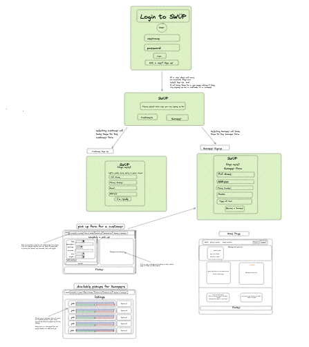
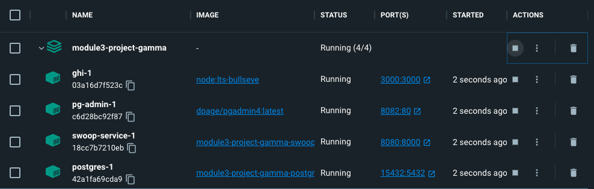

# Swüp Project

**Team:**

* Andy Lam - Software Developer
* Daniel Nam - Software Developer
* Christian Lee - Software Developer
* Ezekiel Samatua - Software Developer
* Anthony Pham - Software Developer

## Design

Introducing Swüp, a convenient application that enables customers to dispose of their waste with just one simple click.

Swüp has been constructed with React for its frontend and leverages FastAPI for its architecture. The application is designed as a monolith, comprising a solitary service referred to as Swoop-Service.

Swoop-Service offers functionalities that enable the management of both customers and Swoopers (employees). This includes the ability to create an account, schedule a pickup, and view a list of their pickup requests, along with post details. Furthermore, customers can sign up to become a Swooper, granting them additional worker privileges, such as accessing the Swoop Center which has available swoops to accept pickup requests and viewing a list of their swoops. They can mark a pickup as completed by clicking on a button once they finish the task.

Swoop-Service has a router director, queries directory and migrations directory.

The migrations directory contains main.py, which defines an asynchronous function migrate() that helps manage database migrations in the FastAPI application. It takes command line arguments for the migration direction and amount. The directory also includes table migrations that create a table in the database to store user and swoop information. This automates schema updates and reduces the risk of errors or data inconsistencies.

## Project Application Diagram



## Getting Started

Please have Docker Desktop downloaded before continuing with the following directions listed below.

#### Cloning the Repository

1. Inside your terminal, change to a directory that you would like to clone this project into.

2. In your terminal, type: ```git clone https://gitlab.com/projectswup/module3-project-gamma.git```

3. Switch into the project directory:

#### Firing up Docker

After running the commands above, type and press enter after each command listed below:

1. ```docker volume create postgres-data```

2. ```docker volume create pg-admin```

3. ```docker-compose build```

4. ```docker-compose up```

<details>
  <summary markdown="span">After successfully following the steps outlined above, you should see all 4 containers running.</summary>


</details>

## Navigating the Front-End

To navigate the server, type ```http://localhost:3000``` , this will take you to our Home Page. Within the Home Page is a navigation bar for easy access to each feature that we created. Below is a complete breakdown of the urls for each feature of the application.

## API Outline

### Swoop-Service API

Swoop-Service utilizes FastAPI that allows users to view a list of all pickups, a detail view of a pickup, create a pickup, a list view of all available pickups and a list of a swooper's history

- **List of pickups** `http://localhost:3000/pickups`
    -  List view of all the pickups a customer created
- **Detail of a pickup** `http://localhost:3000/pickups/{pickup_id}`
    -  List view of all the pickups a customer created
- **Create pickup** `http://localhost:3000/newpickup`
    - Allows the user to create a new pickup
- **List of available pickups** `http://localhost:3000/listings`
    - List view of all available pickups
- **List of Swooper History** `http://localhost:3000/swoops`
    - Gets a list of a swooper's history


## Swoop-Service

Within the Swoop-Service directory, the queries directory will have a swoop.py and user.py file. The code within these files defines several **Pydantic models** for handling data related to "swoops" (i.e., trash pickups) in a FastAPI application. The ```SwoopsIn``` model defines the data required for creating a new swoop request, while ```SwoopsOut``` and ```SwoopsOutWithUsers``` represent the data that is returned when retrieving information about a swoop. The ```SwoopsAccept``` model defines the data required for accepting a swoop request.

The user.py file are used to define the schema for interacting with the Users table in the application's database.

```DuplicateAccountError``` is a custom exception raised when attempting to create a new user with an email or username that already exists.
```UsersIn``` defines the schema for creating a new user, specifying the required fields such as ```first_name```, ```last_name```, ```email```, etc.
```UsersOut``` defines the schema for retrieving a user's data from the database, including the ```user_id```, ```first_name```, ```last_name```, ```email```, etc.
```UsersProfileUpdate``` defines the schema for updating a user's profile information.
```UsersOutWithPassword``` extends ```UsersOut``` and includes the hashed_password field, which is typically not returned in API responses for security reasons.
``UserUpdate`` defines the schema for updating a user's ```car``` and ```license_number``` information.

Both files include a repository class, respectively.
```SwoopsRepository``` class includes methods to get a single swoop, get a swooper history, create a swoop, get all available swoops, get all customer posts, accept a job as a swooper, complete a swoop job, get detail of a single customer post. Upon creation of a post, the status is set to "0" which means it is ***not accepted***. Once a swooper accepts the job, the status turns to "1" for ***in progress***. Once completed, the Swooper will select "Complete" which will turn the status to "2" for ***completed***.

```UserRepo``` class includes methods to create an account, get details of an account, update an account to enable employee view, update personal profile and get a list of all users.

**FastAPI Endpoints:**
| Action  | Method   | URL   |
|:---:|:---:|:---:|
| List of Customer Pickup Post| GET  | http://localhost:8080/pickups  |
| Create new Pickup  | POST  |  http://localhost:8080/pickups  |
| List of available Swoops  | GET  |  http://localhost:8080/listings  |

<details>
  <summary markdown="span">GET: List of Customer Post</summary>
Returns:

```
[
  {
    "user_id": null,
    "first_name": "ant",
    "last_name": "p",
    "phone_number": "string",
    "email": "a@pham.com",
    "address": "1234 main street",
    "car": "Honda Civic",
    "license_number": "6BOA722",
    "username": "string",
    "hashed_password": "$2b$12$ZkNQ.NSkeb6RRKstkGbD4Om.stZv1dyvuSOE3Lp5fRD7cBONtOfbG",
    "is_swooper": true,
    "pickup_id": 2,
    "customer_id": 1,
    "swooper_id": null,
    "trash_type": "oil",
    "description": "car oil",
    "picture_url": "string",
    "hazards": "oil",
    "size": "small",
    "weight": 4,
    "status": 0
  },
  {
    "user_id": null,
    "first_name": "ant",
    "last_name": "p",
    "phone_number": "string",
    "email": "a@pham.com",
    "address": "1234 main street",
    "car": "Honda Civic",
    "license_number": "6BOA722",
    "username": "string",
    "hashed_password": "$2b$12$ZkNQ.NSkeb6RRKstkGbD4Om.stZv1dyvuSOE3Lp5fRD7cBONtOfbG",
    "is_swooper": true,
    "pickup_id": 3,
    "customer_id": 1,
    "swooper_id": 2,
    "trash_type": "large mirror",
    "description": "a large mirror",
    "picture_url": "https://encrypted-tbn0.gstatic.com/images?q=tbn:ANd9GcRAKDejfQroXqsHlKfjw161o9ZIZLrGT3MBSg&usqp=CAU",
    "hazards": "sharp objects",
    "size": "large",
    "weight": 25,
    "status": 1
  },
  {
    "user_id": null,
    "first_name": "ant",
    "last_name": "p",
    "phone_number": "string",
    "email": "a@pham.com",
    "address": "1234 main street",
    "car": "Honda Civic",
    "license_number": "6BOA722",
    "username": "string",
    "hashed_password": "$2b$12$ZkNQ.NSkeb6RRKstkGbD4Om.stZv1dyvuSOE3Lp5fRD7cBONtOfbG",
    "is_swooper": true,
    "pickup_id": 1,
    "customer_id": 1,
    "swooper_id": 2,
    "trash_type": "furniture",
    "description": "large furniture",
    "picture_url": "string",
    "hazards": "none",
    "size": "large",
    "weight": 20,
    "status": 2
  },
```

</details>

<details>
  <summary markdown="span">POST: Creating a new pickup request</summary>
Request Body:

```
{
  "trash_type": "string",
  "description": "string",
  "picture_url": "string",
  "hazards": "string",
  "size": "string",
  "weight": 0
}
```

Returns:

```
{
  "pickup_id": 1,
  "customer_id": 1,
  "swooper_id": null,
  "trash_type": "electronic",
  "description": "computer",
  "picture_url": "stringurlhere",
  "hazards": "none",
  "size": "Large",
  "weight": 10,
  "status": 0
}
```
</details>

<details>
  <summary markdown="span">GET: List of Available Swoops</summary>
Returns:

```
[
  {
    "user_id": null,
    "first_name": "ant",
    "last_name": "p",
    "phone_number": "string",
    "email": "a@pham.com",
    "address": "1234 main street",
    "car": "Honda Civic",
    "license_number": "6BOA722",
    "username": "string",
    "hashed_password": "$2b$12$ZkNQ.NSkeb6RRKstkGbD4Om.stZv1dyvuSOE3Lp5fRD7cBONtOfbG",
    "is_swooper": true,
    "pickup_id": 2,
    "customer_id": 1,
    "swooper_id": null,
    "trash_type": "oil",
    "description": "car oil",
    "picture_url": "string",
    "hazards": "oil",
    "size": "small",
    "weight": 4,
    "status": 0
  },
  {
    "user_id": null,
    "first_name": "ant",
    "last_name": "p",
    "phone_number": "string",
    "email": "a@pham.com",
    "address": "1234 main street",
    "car": "Honda Civic",
    "license_number": "6BOA722",
    "username": "string",
    "hashed_password": "$2b$12$ZkNQ.NSkeb6RRKstkGbD4Om.stZv1dyvuSOE3Lp5fRD7cBONtOfbG",
    "is_swooper": true,
    "pickup_id": 5,
    "customer_id": 1,
    "swooper_id": null,
    "trash_type": "electronic",
    "description": "computer",
    "picture_url": "stringurlhere",
    "hazards": "none",
    "size": "Large",
    "weight": 10,
    "status": 0
  }
]
```

</details>


| Action  | Method   | URL   |
|:---:|:---:|:---:|
| List of Swooper's History  | GET   | http://localhost:8080/api/swoops |
| Update Swoop To Accept | GET | http://localhost:8080/swoops/accept/{pickup_id}   |
| Update Swoop To Completed | GET | http://localhost:8080/swoops/complete/{pickup_id}   |

<details>
  <summary markdown="span">GET: List of Swooper's History</summary>
Returns:

```
[
  {
    "user_id": null,
    "first_name": "ant",
    "last_name": "p",
    "phone_number": "string",
    "email": "a@pham.com",
    "address": "1234 main street",
    "car": "Honda Civic",
    "license_number": "6BOA722",
    "username": "string",
    "hashed_password": "$2b$12$ZkNQ.NSkeb6RRKstkGbD4Om.stZv1dyvuSOE3Lp5fRD7cBONtOfbG",
    "is_swooper": true,
    "pickup_id": 3,
    "customer_id": 1,
    "swooper_id": 2,
    "trash_type": "large mirror",
    "description": "a large mirror",
    "picture_url": "https://encrypted-tbn0.gstatic.com/images?q=tbn:ANd9GcRAKDejfQroXqsHlKfjw161o9ZIZLrGT3MBSg&usqp=CAU",
    "hazards": "sharp objects",
    "size": "large",
    "weight": 25,
    "status": 1
  },
  {
    "user_id": null,
    "first_name": "ant",
    "last_name": "p",
    "phone_number": "string",
    "email": "a@pham.com",
    "address": "1234 main street",
    "car": "Honda Civic",
    "license_number": "6BOA722",
    "username": "string",
    "hashed_password": "$2b$12$ZkNQ.NSkeb6RRKstkGbD4Om.stZv1dyvuSOE3Lp5fRD7cBONtOfbG",
    "is_swooper": true,
    "pickup_id": 1,
    "customer_id": 1,
    "swooper_id": 2,
    "trash_type": "furniture",
    "description": "large furniture",
    "picture_url": "string",
    "hazards": "none",
    "size": "large",
    "weight": 20,
    "status": 2
  },
  ]
```
</details>

<details>
<summary markdown="span">PUT: Update Swoop to Accepted </summary>
Request Body:

```
  pickup_id: 5
  ```

Returns:
```
{
  "pickup_id": 5,
  "status": 1,
  "swooper_id": 1
}

```
</details>

<details>
<summary markdown="span">PUT: Update Swoop to Completed </summary>
Request Body:

```
  pickup_id: 5
  ```

Returns:
```
{
  "pickup_id": 5,
  "status": 2,
  "swooper_id": 1
}

```
</details>
